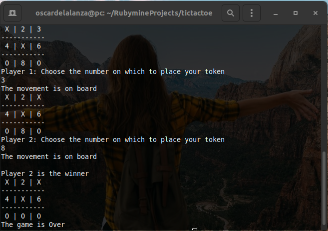

# tic-tac-toe

> In this project, We build a Tic Tac Toe game. The main goal is to put into practice the main concepts of Object Oriented Programming.

 

## Built with

- Ruby

### Game description
Tic-tac-toe (American English), noughts and crosses (British English), or Xs and Os is a paper-and-pencil game for two players, X and O, who take turns marking the spaces in a 3×3 grid. The player who succeeds in placing three of their marks in a horizontal, vertical, or diagonal row wins the game.

### How to Play 
+ Run the file `ruby bin/main.rb`
+ Enter your player name, and let the other player enter their player name too
+ The game automatically assigns the first player the X token and the second player the O token
+ Follow the instructions on the user interface i.e enter the number of the grid where you would like to place your token
+ Do not place your token on a grid that is already chosen by the other player
+ The first player to succeed in placing three of their marks in a horizontal, vertical, or diagonal row wins the game.

> To get a local copy up and running follow these simple example steps.
 
### Prerequisites

- `git`
- `Ruby`

### Setup

To clone the project into your local environment do the following

- open a new `terminal` window and navigate to the directory where the project will be stored
- run the command `git clone git@github.com:oscardelalanza/tic-tac-toe.git`
- run the command `cd tic-tac-toe` to enter to the project directory

### Usage

- inside `tic-tac-toe` directory run the command `ruby bin/main.rb` 

### Run tests

- no written tests yet

## Authors

👤 **Oscar De La Lanza**

- Github: [@oscardelalanza](https://github.com/oscardelalanza)
- Twitter: [@twitterhandle](https://twitter.com/oscardelalanza)
- Linkedin: [Oscar De La Lanza](https://linkedin.com/in/oscardelalanza/)
- Email: oscardelalanza@gmail.com

👤 **Leonard Rwai**

- [@rmauritsson](https://github.com/rmauritsson/)

## 🤝 Contributing

Contributions, issues and feature requests are welcome!

Feel free to check the [issues page](issues/).

## Show your support

Give a ⭐️ if you like this project!