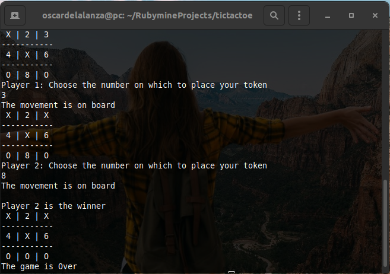
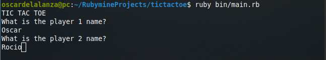
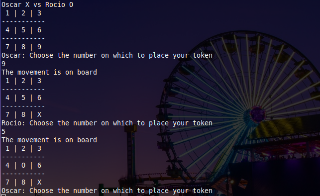
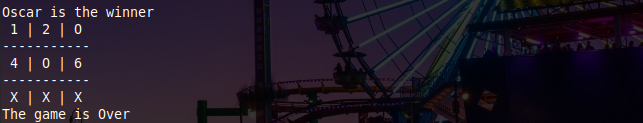

# tic-tac-toe

> In this project, We build a Tic Tac Toe game. The goal is to put into practice the main concepts of Object-Oriented Programming.

 

## Built with

- Ruby

### Game description
Tic-tac-toe (American English), noughts and crosses (British English), or Xs and Os is a paper-and-pencil game for two players, X and O, who take turns marking the spaces in a 3×3 grid. The player who succeeds in placing three of their marks in a horizontal, vertical, or diagonal row wins the game.

## Getting Started

### Prerequisites

- `Git`
- `Ruby`

### Setup

To clone the project in your local environment do the following.

- Open a new `terminal` window and navigate to the directory where the project will be stored.
- Run the command `git clone git@github.com:oscardelalanza/tic-tac-toe.git`.
- Run the command `cd tic-tac-toe` to enter the project directory.

### Install

- Not needed.

### Usage

- To start the game run the command `ruby bin/main.rb`.
- Once you start the game, you must type the names of each player.

- After setting up the player names, the game will assign the token `X` for player 1 and the token `0` for player 2.
- Immediately the game will ask for a position to `Player 1` and `Player 2` respectively. Just type de position number and
switch turns with your opponent.

- If the game detect a `winner` or a `draw` the program will end and display the results.
  

### Run tests

- This project doesn't contain tests

## Authors

👤 **Oscar De La Lanza**

- Github: [@oscardelalanza](https://github.com/oscardelalanza)
- Twitter: [@twitterhandle](https://twitter.com/oscardelalanza)
- Linkedin: [Oscar De La Lanza](https://linkedin.com/in/oscardelalanza/)
- Email: oscardelalanza@gmail.com

👤 **Leonard Rwai**

- [@rmauritsson](https://github.com/rmauritsson/)

## 🤝 Contributing

Contributions, issues and feature requests are welcome!

Feel free to check the [issues page](issues/).

## Show your support

Give a ⭐️ if you like this project!